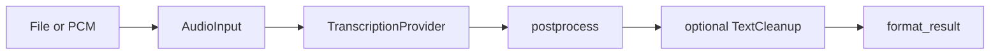

# Architecture

```text
aurum-stt (CLI)              aurum-ffi (planned)
         \                      /
          \                    /
           ▼                  ▼
                 aurum-core
  audio/        file load + limits + from_pcm
  pcm/          mic buffer helpers (Rust hosts)
  window/       partial-window policy (host-driven)
  cancel/       CancelFlag
  model/        catalogue, download, lock, integrity
  providers/    local whisper.cpp · openrouter
  postprocess/  ASR markers, clamp, NaN guard
  cleanup/      rules | openrouter LLM
  output/       txt · srt · json
  config/
  error/        user | environment | provider
```

Embedders should prefer **`aurum-ffi`** (see [FFI design](aurum-ffi.md)) over
shelling out to the CLI. FFI freezes a **narrow façade**; `aurum-core` may still
churn until a stable Rust `0.1.0` / `1.0`.

## Pipeline



## Design rules

1. **CLI owns UX** — progress, first-run tips, OpenRouter SRT policy
2. **Core owns truth** — providers return normalized results + honesty fields
3. **FFI owns stability for embeds** — small C/UniFFI surface; see [aurum-ffi](aurum-ffi.md)
4. **Fail closed** — bad magic, oversized audio, missing keys, offline missing models
5. **No default network** except explicit model download or remote provider
6. **ASR ≠ cleanup** — separate stages (transcription vs text cleanup)

## Process model cache

`LocalWhisperProvider` keeps a process-global `WhisperContext` map keyed by model
path. Drop contexts via `clear_context_cache()` before exit so Metal/ggml teardown
does not assert. FFI exposes this as `aurum_shutdown` / engine destroy.
