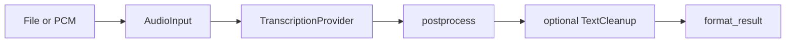
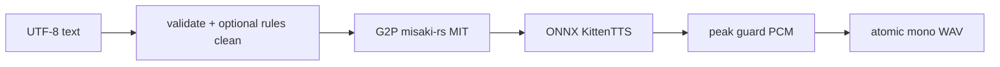

# Architecture

```text
aurum-stt (CLI)              aurum-ffi (C / embedders)
         \                      /
          \                    /
           ▼                  ▼
                 aurum-core
  audio/        file load + limits + from_pcm
  pcm/          mic buffer helpers (Rust hosts)
  window/       partial-window policy (host-driven)
  cancel/       CancelFlag
  model/        STT catalogue, download, lock, integrity
  providers/    local whisper.cpp · openrouter
  postprocess/  ASR markers, clamp, NaN guard
  cleanup/      rules | openrouter LLM
  tts/          local ONNX KittenTTS · catalogue · wav
  output/       txt · srt · json (STT)
  config/
  error/        user | environment | provider
```

## Pipelines

### STT



### TTS



STT and TTS share error taxonomy, cache root, cancel flags, and config loading — but **modules stay separate** (`providers/` vs `tts/`). FFI does not expose TTS in this MVP.

## Design rules

1. **CLI owns UX** — progress, first-run tips, OpenRouter SRT policy, TTS overwrite policy  
2. **Core owns truth** — providers return normalized results + honesty fields  
3. **FFI owns a narrow embed surface** — PCM, preload, cancel, rules cleanup ([guide](../library/ffi.md)); no TTS ABI yet  
4. **Fail closed** — bad magic, oversized audio, missing keys, offline missing models/voices, bad SHA-256  
5. **No default network** except explicit model/voice download or remote STT provider  
6. **ASR ≠ cleanup ≠ TTS** — separate stages and modules  
7. **MIT binary for default TTS** — no GPL-linked phonemizer on the default path ([TTS guide](../guide/tts.md))

## Process model cache

`LocalWhisperProvider` keeps a process-global `WhisperContext` map keyed by model
path. Drop contexts via `clear_context_cache()` (or `aurum_shutdown` from FFI)
before process exit so Metal/ggml teardown does not assert.
