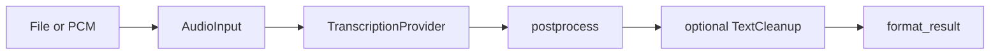

# Architecture

```text
aurum (CLI)
 └── aurum-core
      ├── audio/          file load + limits + upload encode + from_pcm
      ├── pcm/            mic buffer helpers
      ├── window/         partial-window policy (host-driven)
      ├── cancel/         CancelFlag
      ├── model/          catalogue, download, lock, integrity
      ├── providers/
      │    ├── local      whisper.cpp + context cache
      │    └── openrouter multimodal chat (ASR)
      ├── postprocess/    ASR markers, clamp, NaN guard
      ├── cleanup/        flow styles (rules | openrouter LLM)
      ├── output/         txt · srt · json
      ├── config/
      └── error/          user | environment | provider
```

## Pipeline



## Design rules

1. **CLI owns UX** — progress, first-run tips, OpenRouter SRT policy  
2. **Core owns truth** — providers return normalized results + honesty fields  
3. **Fail closed** — bad magic, oversized audio, missing keys, offline missing models  
4. **No default network** except explicit model download or remote provider  
5. **ASR ≠ cleanup** — separate stages (Zephyr WhisperEngine vs FlowProcessor)

## Process model cache

`LocalWhisperProvider` keeps a process-global `WhisperContext` map keyed by model
path. Drop contexts via `clear_context_cache()` before exit so Metal/ggml teardown
does not assert.
