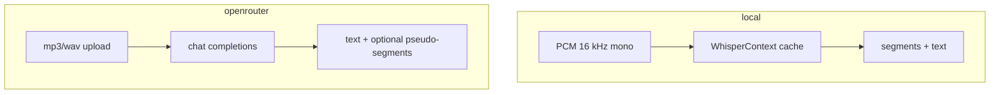

# Providers

## Local (default)

| | |
|--|--|
| Engine | whisper.cpp via `whisper-rs` |
| Auth | None |
| GPU | Metal on macOS builds |
| Context | Process-level model cache (call `clear_context_cache()` before exit in long-lived hosts) |

## OpenRouter

| | |
|--|--|
| Transport | Multimodal chat completions (`input_audio`) |
| Auth | `OPENROUTER_API_KEY` |
| Semantics | **LLM-assisted** — may paraphrase; timestamps unreliable |
| JSON | `backend_kind: "llm_assisted"`, `timestamps_reliable: false` |
| SRT | Refused unless `--allow-unreliable-timestamps` |

