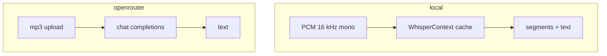

# Providers

ASR backends implement `TranscriptionProvider`. Cleanup is a **separate** stage
(see [Cleanup](cleanup.md)).

## Local (default)

| | |
|--|--|
| Engine | whisper.cpp via `whisper-rs` |
| Auth | None |
| GPU | Metal on macOS builds |
| Models | ggml catalogue — `aurum models` |
| Context | Process-level cache; call `clear_context_cache()` before exit in long-lived hosts |
| Integrity | Magic check + pinned SHA-256 for common models |

```bash
aurum talk.m4a --model tiny-q5_1
aurum talk.m4a --model base
```

## OpenRouter

| | |
|--|--|
| Transport | Multimodal chat completions (`input_audio`) |
| Auth | `OPENROUTER_API_KEY` (preferred) or config |
| Semantics | **LLM-assisted** — may paraphrase; not a dedicated ASR API |
| JSON | `backend_kind: "llm_assisted"`, `timestamps_reliable: false` |
| SRT | Refused unless `--allow-unreliable-timestamps` |

### Suggested models (audio input)

| Model | Notes |
|-------|--------|
| `google/gemini-2.5-flash-lite` | Cheap multimodal |
| `openai/gpt-audio-mini` | Strong audio quality in our tests |
| `mistralai/voxtral-small-24b-2507` | Speech-oriented |
| `google/gemini-2.5-flash` | Balanced default-class Gemini |

```bash
export OPENROUTER_API_KEY=sk-or-...
aurum talk.mp3 --provider openrouter --model google/gemini-2.5-flash-lite
aurum talk.mp3 --provider openrouter --model openai/gpt-audio-mini -o json
```

!!! note "Privacy settings"
    OpenRouter account privacy/guardrails must allow the chosen provider, or you
    will see `No endpoints available matching your guardrail restrictions`.
    Configure at https://openrouter.ai/settings/privacy


