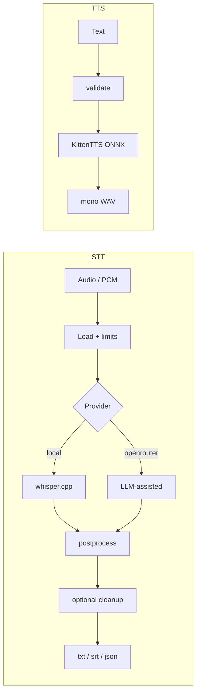

# Aurum

**Audio in. Text out. On-device by default.**

Aurum is private **speech I/O** on your machine:

- **STT** — audio → text with **whisper.cpp** (optional OpenRouter)
- **Cleanup** — post-transcript flow styles (rules or LLM)
- **TTS** — text → mono WAV with **local ONNX** (KittenTTS; no cloud)

The same core powers the `aurum` CLI, Rust embeds (`aurum-core`), and native embeds (`aurum-ffi`).

!!! tip "Local by default"
    No API key required on the default path. Models download once into the platform cache, then inference stays local.

## 30-second path

```bash
git clone https://github.com/joe-broadhead/aurum.git
cd aurum
./scripts/install.sh
# or: cargo install aurum-stt

aurum models
aurum meeting.m4a --model tiny-q5_1
aurum meeting.m4a --cleanup clean
aurum tts "Hello from aurum" --output-file /tmp/hello.wav
```

## Architecture



## Workspace

| Crate | Role |
|-------|------|
| [`aurum-core`](library/overview.md) | Engine library (STT + TTS + cleanup) |
| [`aurum-stt`](https://crates.io/crates/aurum-stt) | CLI (`aurum` binary) |
| [`aurum-ffi`](library/ffi.md) | C ABI for native STT hosts |

## Where to go next

| Goal | Page |
|------|------|
| Install | [Installation](getting-started/installation.md) |
| First transcript | [Quickstart](getting-started/quickstart.md) |
| CLI flags | [CLI reference](getting-started/cli.md) |
| Cleanup / flow | [Cleanup](guide/cleanup.md) |
| Text-to-speech | [TTS](guide/tts.md) |
| Embed in Rust | [Library integration](library/integration.md) |
| Native / C embeds | [FFI](library/ffi.md) |
| Partials & cancel | [Partials](library/partials.md) |
| Contribute | [Contributing](development/contributing.md) |

## Status

**v0.0.1** — GitHub Release binaries + crates.io (`aurum-core`, `aurum-stt`, `aurum-ffi`) with local TTS + FFI.  
TTS ships as `aurum tts` (local WAV MVP). Library APIs may change before `0.1.0`; pin a release tag when depending from other projects.
