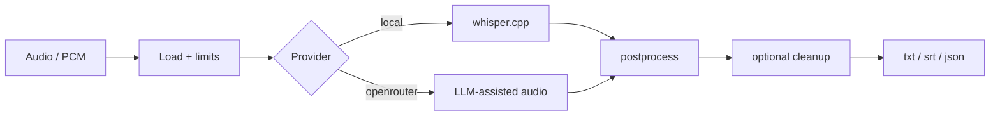

# Aurum

**Audio in. Text out. On-device by default.**

Aurum turns audio files into text with **whisper.cpp on-device by default**, optional OpenRouter, and Zephyr-style cleanup. The same core powers the `aurum` CLI and embeds in apps like ZephyrFlow.

!!! tip "Local by default"
    No API key required on the default path. Models download once into the platform cache, then inference stays local.

## 30-second path

```bash
git clone https://github.com/joe-broadhead/aurum.git
cd aurum
./scripts/install.sh
aurum models
aurum meeting.m4a --model tiny-q5_1
aurum meeting.m4a --cleanup clean
```

## Architecture



## Workspace

| Crate | Role |
|-------|------|
| [`aurum-core`](library/overview.md) | Library: providers, PCM, models, cleanup, output |
| `aurum` | CLI binary |

## Where to go next

| Goal | Page |
|------|------|
| Install | [Installation](getting-started/installation.md) |
| First transcript | [Quickstart](getting-started/quickstart.md) |
| CLI flags | [CLI reference](getting-started/cli.md) |
| Cleanup / flow | [Cleanup](guide/cleanup.md) |
| Embed in Rust | [Library integration](library/integration.md) |
| Partials & cancel | [Partials](library/partials.md) |
| Contribute | [Contributing](development/contributing.md) |

## Status

**v0.0.0** public preview. CLI is usable; `aurum-core` may break until `0.1.0`. Prefer a pinned git `rev` or release tag in dependents.
