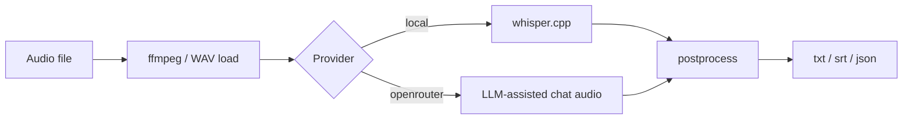

# Aurum

**Local-first transcription CLI and reusable Rust core.**

Aurum *(Latin: gold)* converts audio files to text using **whisper.cpp on-device by default**, with an optional OpenRouter remote path. The same core powers the `aurum` binary and can be embedded in apps like ZephyrFlow.

!!! tip "Local by default"
    No API key required for the default path. Models download once into the platform cache, then inference stays local.

## 30-second path

```bash
git clone https://github.com/joe-broadhead/aurum.git
cd aurum
cargo install --path crates/aurum --locked
aurum meeting.m4a --model tiny-q5_1
```

## Architecture



## Workspace

| Crate | Role |
|-------|------|
| [`aurum-core`](library/overview.md) | Reusable library (providers, audio, models, output) |
| `aurum` | CLI binary |

## Where to go next

| Goal | Page |
|------|------|
| Install a binary or from source | [Installation](getting-started/installation.md) |
| First successful transcript | [Quickstart](getting-started/quickstart.md) |
| Embed in another Rust project | [Library integration](library/integration.md) |
| Release process | [Release](development/release.md) |
| Contribute | [Contributing](development/contributing.md) |

## Status

`v0.0.0` is experimental. The CLI is usable; the `aurum-core` API may change before `0.1.0`. No crates.io publish until explicitly approved.
