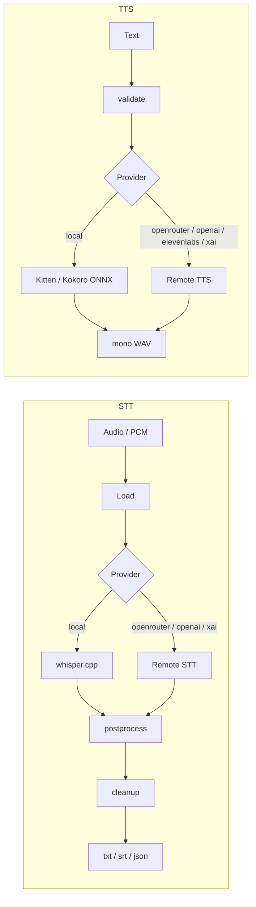

# Aurum

**Speech both ways. On-device by default.**

Private **speech I/O** on your machine:

- **STT** — audio → text (whisper.cpp local default; optional OpenRouter / OpenAI / xAI)
- **Cleanup** — post-transcript styles (on-device rules or OpenRouter LLM)
- **TTS** — text → mono WAV (local ONNX KittenTTS / Kokoro; optional OpenRouter / OpenAI / ElevenLabs / xAI)

The same core powers the `aurum` CLI, Rust embeds (`aurum-core`), and native embeds (`aurum-ffi`).

!!! tip "Local by default"
    No API key required on the default path. Models download once into the platform cache, then stay local. Remote providers are **opt-in** and never selected merely because a key is present.

## 30-second path

```bash
git clone https://github.com/joe-broadhead/aurum.git
cd aurum
./scripts/install.sh
# or: cargo install aurum-stt

aurum models
aurum meeting.m4a --model tiny-q5_1
aurum meeting.m4a --cleanup clean
aurum tts "Hello from aurum" --output-file /tmp/hello.wav
```

## Architecture



## Workspace

| Crate | Role |
|-------|------|
| [`aurum-core`](library/overview.md) | Engine (STT + TTS + cleanup + providers) |
| [`aurum-stt`](https://crates.io/crates/aurum-stt) | CLI (`aurum`) |
| [`aurum-ffi`](library/ffi.md) | C ABI for native **local** STT/TTS hosts |

## Where to go next

| Goal | Page |
|------|------|
| Install | [Installation](getting-started/installation.md) |
| Quickstart | [Quickstart](getting-started/quickstart.md) |
| CLI | [CLI reference](getting-started/cli.md) |
| Providers | [Providers](guide/providers.md) · [Matrix](guide/provider-matrix.md) |
| TTS | [TTS guide](guide/tts.md) |
| Cleanup | [Cleanup](guide/cleanup.md) |
| Rust embed | [Integration](library/integration.md) |
| Native embeds | [FFI](library/ffi.md) |
| Operators | [Handbook](operations/handbook.md) |
| Contribute | [Contributing](development/contributing.md) |

## Status

**v0.0.22** (published tip) — product outcomes & SDK coherence (JOE-2215): quality observatory, TTS listening, named-hardware perf, long-form fidelity, batch v2, SDK contracts, observability, provider evidence, product contracts, native SDK packages.

**Prior published tip: v0.0.21** — production-assurance cut. Aurum stays on the **0.0.x** iteration line; a major `1.0.0` is **not** planned. Published as tag `v0.0.22` (JOE-2226 Wave 5).

APIs may still change on `0.0.x`; pin a release **tag** (or crates.io version) in dependents.
