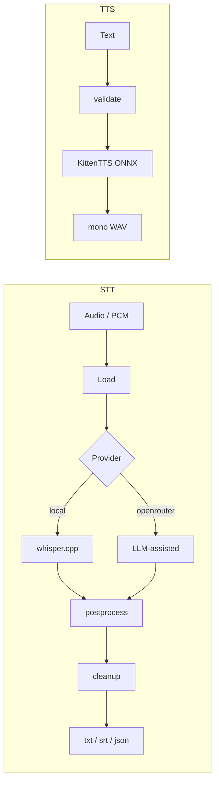

# Aurum

**Speech both ways. On-device by default.**

Private **speech I/O** on your machine:

- **STT** — audio → text (whisper.cpp; optional OpenRouter)
- **Cleanup** — post-transcript flow styles (rules or LLM)
- **TTS** — text → mono WAV (local ONNX KittenTTS; no cloud)

The same core powers the `aurum` CLI, Rust embeds (`aurum-core`), and native STT embeds (`aurum-ffi`).

!!! tip "Local by default"
    No API key required on the default path. Models download once into the platform cache, then stay local.

## 30-second path

```bash
git clone https://github.com/joe-broadhead/aurum.git
cd aurum
./scripts/install.sh
# or: cargo install aurum-stt

aurum models
aurum meeting.m4a --model tiny-q5_1
aurum meeting.m4a --cleanup clean
aurum tts "Hello from aurum" --output-file /tmp/hello.wav
```

## Architecture



## Workspace

| Crate | Role |
|-------|------|
| [`aurum-core`](library/overview.md) | Engine (STT + TTS + cleanup) |
| [`aurum-stt`](https://crates.io/crates/aurum-stt) | CLI (`aurum`) |
| [`aurum-ffi`](library/ffi.md) | C ABI for native **STT** hosts |

## Where to go next

| Goal | Page |
|------|------|
| Install | [Installation](getting-started/installation.md) |
| Quickstart | [Quickstart](getting-started/quickstart.md) |
| CLI | [CLI reference](getting-started/cli.md) |
| TTS | [TTS guide](guide/tts.md) |
| Cleanup | [Cleanup](guide/cleanup.md) |
| Rust embed | [Integration](library/integration.md) |
| Native STT | [FFI](library/ffi.md) |
| Contribute | [Contributing](development/contributing.md) |

## Status

**v0.0.14** — Group H 1.0 assurance slice: cosign, long fuzz, clean-install CI, repro.  
APIs may change before `0.1.0`; pin a release tag in dependents.
